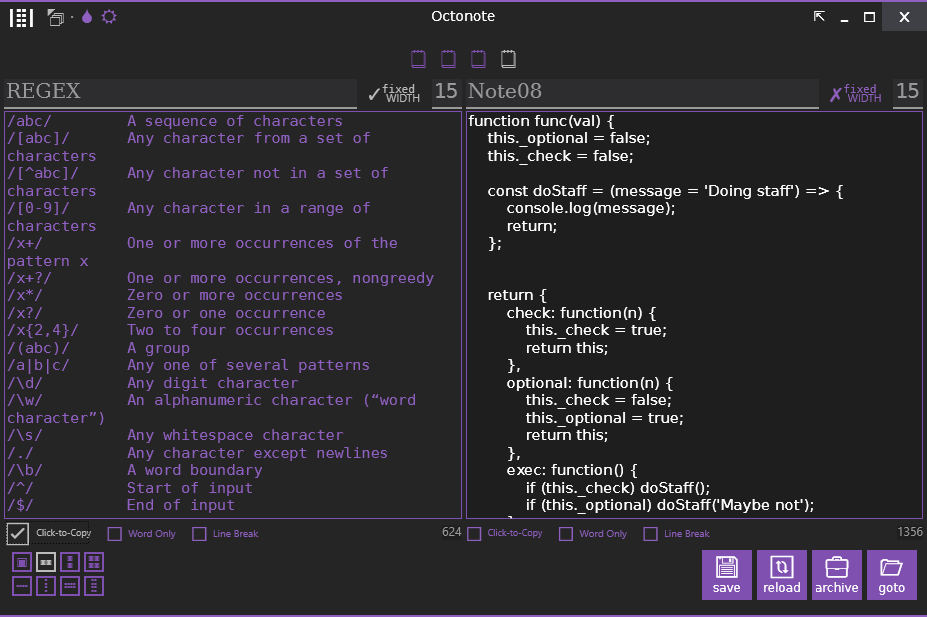

# OctoNote (WPF)
**Last Updated:** 27 February 2014

This is the code repository for a WPF app called "OctoNote". 
It is called OctoNote because there are 8 and only eight tabs of notes.

OPTIONS:
- Fixed-width (monospace) or not (sans serif) toggle
- Easy font-size selection
- Note titles/labels
- Click-to-copy feature (makes it read-only and clickable)
- Layout selectors:
  - One note
  - Two notes left to right
  - Two notes top to bottom
  - Four notes 2×2
  - Four notes left to right
  - Four notes top to bottom
  - Eight notes left to right
  - Eight notes top to bottom
- Save notes (persisitent)
- Reload unsaved notes
- Archive notes (using 7zip)
- Navigate to file (goto)

This app uses my own Window template which includes:
- Dark/White Theme
- Color Schemes
- Always On-Top option.
- In-place Collapse/Expand

**NOTE:** I still use this app to this day.
